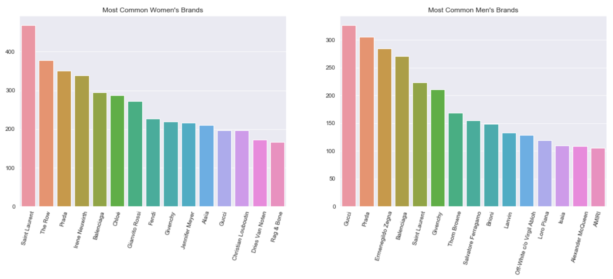
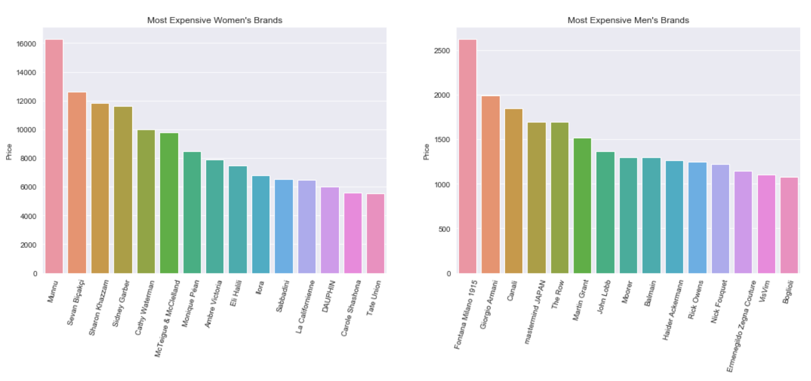
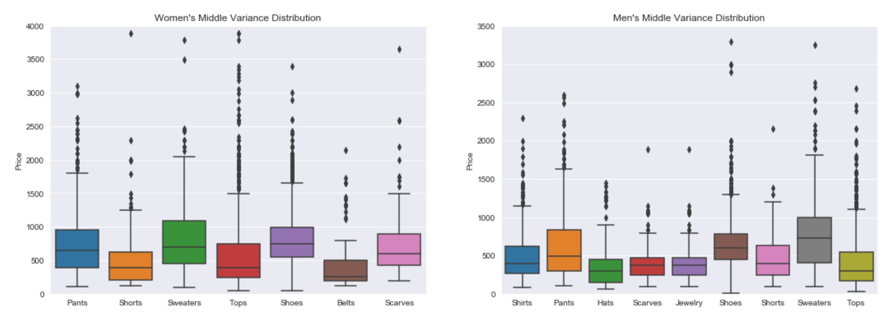
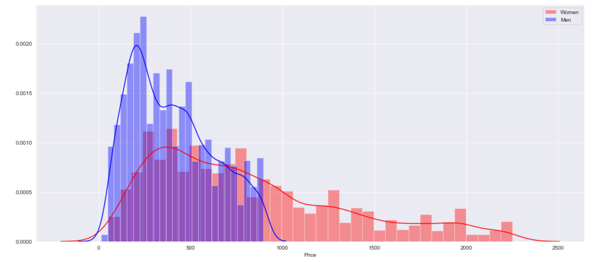
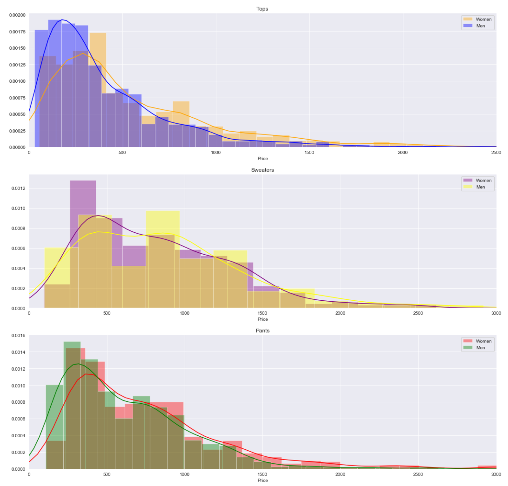
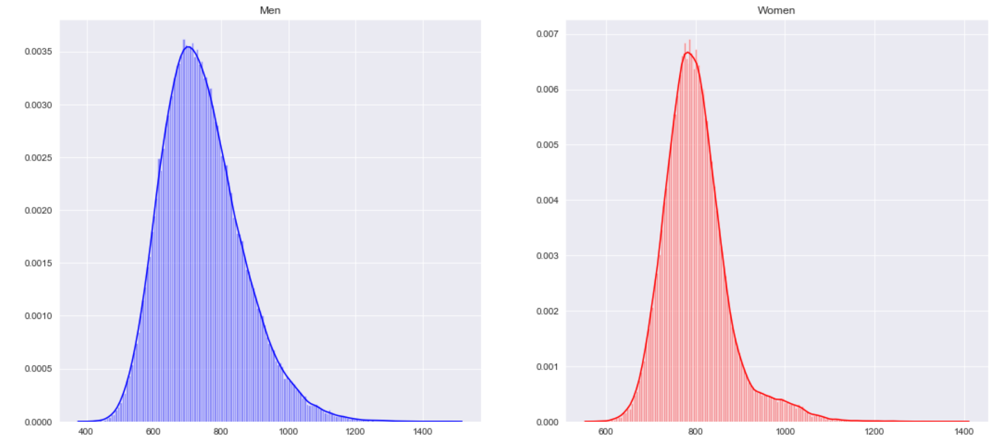

# Barney's Pricing Webscrape & Analysis
Scraping, analysis and statistical testing of the iconic department store's men's and women's online departments.

## The Scrape
* Scraped several category pages for men's and women's clothing individually using two different functions
* Used Selenium to close pop up out of each category, then handed off actual scraping to Beauitful Soup

## Data Aggregation
* Approximately 9,000 different items of men's clothing and about 15,000 for women
* Performed basic analysis and visualizations to get a better sense of the data, like most common brands (excluding the retailer's own) and most expensive

* As can be seen above, most common brands mostly showed familiar names while most expensive offered more variety
* What's more revealing is how much higher the top prices for women's were than men's

## Deeper Examination of Variance
* Grouped data by category of clothing and calculated standard deviations for each noting that overall variation of women's clothing was much higher than men's, not surprising considering how much higher the prices are for them
    * Jewelry varied greatly between genders, landing at a whopping $7,341.48 for women, but only $290.78 for men
    * Coats varied greatly for both, with women at $3,899.57 and men $1,556.76
* Below charts represented categories with middle levels of variance by gender. Note that some outliers are cutoff for visibility:

* To reaffirm this difference between men's and women's items, I visualized the first eight deciles of the pricing data (max of $2,500 vs. $90,000) to get a better sense of overall distribution by sex:

* Clearly men's prices are more closely clustered and lower overall than women's, but drilling down by category, I found more similarities:

* Instead of filtering for deciles, I set a limit on the x-axis as the right tails were quite long as to expected at this point

## Statistical Analysis with a Surprise Guest
* Analyzed famous rapper Future's performance relative to the rest of the store's catalogue when he went shopping at Barney's when he was on the web series Sneaker Shopping
* He spent $35,795 pretax on 33 items overall, 29 men's (shoes, socks, sweaters, tops coats and pants) and 4 women's (shoes)
* In order to get a more accurate sense of how he did, the skewness of the data needed to be removed and normalized, which was done by taking 100,000 samples of 50 random items and finding their means after filtering for only the categories he shopped for, visualized below:

* Because the data was so skewed before, even after this many sample means were taken, there was still some slight positive skeness, but stil ran tests assuming a normal distribution
* Because they were small, ran two one-sample t-tests separately for the men's and women's clothing to see if his spree fell within the right-tailed critical region
* Despite this being an 'easy' test to pass, he barely did not for men's coming 10% short (1.842 t-stat vs. 2.048 critical threshold), but performed far better for women's (-10.564 t-stat vs 3.182 critical threshold)
